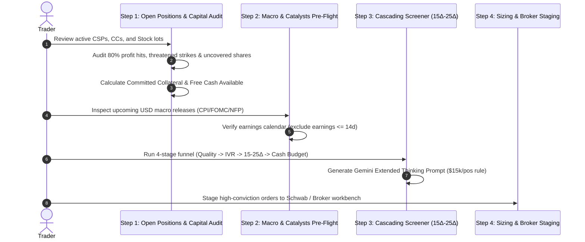

# End-of-Week Options Routine & Cascading Screener (15Δ–25Δ) Architecture

## 1. System Overview

The **End-of-Week Options Routine & Cascading Screener** architecture provides systematic retail options income investors with a disciplined, institutional framework for weekend portfolio maintenance, cash budgeting, and high-conviction candidate selection.

### Key Tenets:
1. **100% Cash-Secured (Zero Margin Risk)**: Cash-Secured Puts (CSPs) are backed dollar-for-dollar with liquid cash (`Strike × 100 × Contracts`). Margin borrowing, naked puts, and overleverage are strictly locked out.
2. **Strict Delta Sweet Spot (0.15Δ – 0.25Δ)**: Strikes are anchored outside the lower 2-Standard Deviation Bollinger Band envelope with a 75% to 85% Probability of Expiring Out-of-the-Money (POP).
3. **80% Profit Taking Rule**: When an open option contract captures &ge; 80% of its initial premium, the system issues a high-priority alert to close the position immediately, eliminating tail gamma risk.
4. **Defensive Rolling**: If the spot price drops within 2.5% of the short put strike, the position is flagged for a defensive down-and-out credit roll.
5. **AI Extended Thinking Sizing ($15k/position)**: Gemini Extended Thinking evaluates candidates across Barchart, MarketChameleon, and Thinkorswim to pick 1 to 5 top put writes within available cash limits.
6. **Calendar-Year Tax Alpha**: Tracks YTD option premiums earned and capital gains/losses, automatically applying prior-year capital loss carryforwards.

---

## 2. The 4-Step End-of-Week Routine

---

## 3. Capital & Tax-Loss Carryforward Mathematics

### 3.1 Committed Collateral & Free Cash
$$\text{Committed Collateral} = \sum_{i=1}^{N} \left( \text{Strike}_i \times 100 \times \text{Contracts}_i \right)$$

$$\text{Free Cash Available} = \max\left(0, \text{Total Liquid Cash} - \text{Committed Collateral}\right)$$

$$\text{Affordable Positions} = \min\left(5, \left\lfloor \frac{\text{Free Cash Available}}{\$15,000} \right\rfloor \right)$$

### 3.2 Net Taxable Gains with Prior-Year Carryforward
$$\text{Net Before Carryforward} = (\text{YTD Option Premiums} + \text{Realized Capital Gains}) - \text{Realized Capital Losses}$$

$$\text{Carryforward Applied} = \min(\text{Prior Year Loss Carryforward}, \max(0, \text{Net Before Carryforward}))$$

$$\text{Net Taxable Income} = \max(0, \text{Net Before Carryforward} - \text{Carryforward Applied})$$

$$\text{Remaining Carryforward} = \text{Prior Year Loss Carryforward} - \text{Carryforward Applied}$$

---

## 4. Cascading Screening Funnel Specification

| Stage | Filter Gate | Criteria / Logic |
| :--- | :--- | :--- |
| **Stage 1** | **Technical Quality** | Barchart Technical Opinion &ge; 70%–80% Buy OR MarketChameleon Primary Trend = Uptrend. Optional Thinkorswim (TOS) watchlist import. Exclude earnings within next 14–21 days. |
| **Stage 2** | **Volatility Harvest** | IV Rank &ge; 35%–50% to ensure sufficient extrinsic time premium. |
| **Stage 3** | **Delta Sweet Spot** | Absolute Delta strictly within **0.15 to 0.25** (75%–85% POP). Puts anchored below Lower Bollinger Band; Calls above resistance. |
| **Stage 4** | **Capital Gate** | Strike Collateral (`Strike × 100`) &le; $15,000 per position AND &le; Free Cash Available. |

---

## 5. File Manifest

- `web/src/utils/capitalAndTaxLedger.ts`: Capital calculation engine, localStorage persistence, and audit heuristics.
- `web/src/components/WeeklyPositionAuditView.tsx`: Step 1 Command Center (Capital ledger, tax ledger, 80% profit alerts, and position tracking).
- `web/src/components/CascadingScreenerView.tsx`: Step 3 Interactive Screener (4-stage funnel, TOS import, and Gemini Extended Thinking prompt bridge).
- `web/src/components/DualMenuTree.tsx`: Revamped navigation with 4-Step Weekly Workflow, Strategy Labs, and Equities Universe.
- `web/src/components/HelpHandbookModal.tsx`: Educational handbook chapter on weekly routine and capital rules.
- `web/src/App.tsx`: Top-level router and contextual toolbar rendering.
