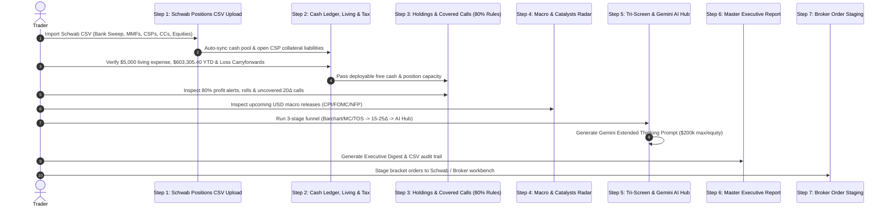

# End-of-Week Options Routine & Cascading Screener (15Δ–25Δ) Architecture

## 1. System Overview

The **End-of-Week Options Routine & Cascading Screener** architecture provides systematic retail options income investors with a disciplined, institutional framework for weekend portfolio maintenance, cash budgeting, and high-conviction candidate selection.

### Key Tenets:
1. **100% Cash-Secured (Zero Margin Risk)**: Cash-Secured Puts (CSPs) are backed dollar-for-dollar with liquid cash reserves (Core Bank Sweep + Money Market Funds SNYXX/SNAXX). Margin borrowing, naked puts, and overleverage are strictly locked out.
2. **Strict Delta Sweet Spot (0.15Δ – 0.25Δ)**: Strikes are anchored outside the lower 2-Standard Deviation Bollinger Band envelope with a 75% to 85% Probability of Expiring Out-of-the-Money (POP).
3. **80% Profit Taking Rule**: When an open option contract captures &ge; 80% of its initial premium, the system issues a high-priority alert to close the position immediately, eliminating tail gamma risk.
4. **Defensive Rolling**: If the spot price drops within 2.5% of the short put strike or reaches 0.50 Delta, the position is flagged for a defensive down-and-out credit roll or repair.
5. **Living Expenses Upfront Deduction**: Encumbers weekly living disbursements ($5,000 default) before sizing new options positions.
6. **Position Sizing & $200,000 Concentration Limit**: Allocates deployable free cash dynamically (`min(5, floor(Free Cash / Target Allocation))`), capping single-equity CSP exposure at $200,000.
7. **Calendar-Year Tax Alpha & Loss Carryforward**: Tracks YTD option premiums earned (anchored to verified 2026 baseline of $603,305.40) and applies prior-year capital loss carryforwards with pre-logging baseline verification.
8. **Dynamic Compliance Health & Real-Time Theta Pulse**: Continuous 100-point compliance scoring and net daily theta run-rate synchronized live between the header badge and Executive Digest.

---

## 2. The 7-Step Institutional End-of-Week Routine

---

## 3. Capital, Living Expenses & Tax-Loss Carryforward Mathematics

### 3.1 Total Liquid Reserves & Committed Collateral
$$\text{Total Liquid Reserves} = \text{Core Bank Deposit Sweep} + \text{SNYXX MMF} + \text{SNAXX MMF}$$

$$\text{Committed Collateral} = \sum_{i=1}^{N} \left( \text{Strike}_i \times 100 \times \text{Contracts}_i \right) \quad \text{for open CSPs}$$

### 3.2 Precalculated Available Cash & Deployable Free Cash
$$\text{Precalculated Available Cash} = \max\left(0, \text{Total Liquid Reserves} - \text{Committed Collateral}\right)$$

$$\text{Deployable Free Cash} = \max\left(0, \text{Precalculated Available Cash} - \text{Weekly Living Disbursement (\$5,000)}\right)$$

$$\text{Affordable Positions} = \min\left(5, \left\lfloor \frac{\text{Deployable Free Cash}}{\text{Target Allocation}} \right\rfloor \right) \quad \text{subject to } \le \$200,000 \text{ per equity}$$

### 3.3 Calendar YTD Premiums & Net Taxable Gains with Prior-Year Carryforward
$$\text{Calendar YTD Premiums} = \text{Starting Baseline (\$603,305.40 for 2026)} + \sum \text{Settled Weekly Closed Premiums}$$

$$\text{Net Before Carryforward} = (\text{Calendar YTD Premiums} + \text{Realized Capital Gains}) - \text{Realized Capital Losses}$$

$$\text{Carryforward Applied} = \min(\text{Prior Year Loss Carryforward}, \max(0, \text{Net Before Carryforward}))$$

$$\text{Net Taxable Income} = \max(0, \text{Net Before Carryforward} - \text{Carryforward Applied})$$

$$\text{Remaining Carryforward} = \text{Prior Year Loss Carryforward} - \text{Carryforward Applied}$$

### 3.4 Dynamic Compliance Health Score (100-Point Model)
$$\text{Health Score} = 100 - (10 \times N_{\text{threatened } |\Delta| \ge 0.40}) - \text{Penalty}_{\text{cash buffer}} - (10 \times N_{\text{CSP} > \$200\text{k}}) - (5 \times N_{\text{unrolled } \ge 80\% \text{ CC}})$$

where:
- $\text{Penalty}_{\text{cash buffer}} = 25$ if $\text{Free Cash} / \text{Net Liq} < 5\%$, $15$ if $< 10\%$, otherwise $0$.
- Score is bounded in $[10, 100]$.

---

## 4. Cascading Screening Funnel Specification

| Stage | Filter Gate | Criteria / Logic |
| :--- | :--- | :--- |
| **Stage 1** | **Technical Quality** | Barchart Technical Opinion &ge; 70%–80% Buy OR MarketChameleon Primary Trend = Uptrend. Optional Thinkorswim (TOS) View 190898 watchlist import. Exclude earnings within next 14–21 days. |
| **Stage 2** | **Volatility Harvest** | IV Rank &ge; 35%–50% to ensure sufficient extrinsic time premium. |
| **Stage 3** | **Delta Sweet Spot** | Absolute Delta strictly within **0.15 to 0.25** (75%–85% POP). Puts anchored below Lower Bollinger Band; Calls above dynamic resistance. |
| **Stage 4** | **Capital Gate** | Strike Collateral (`Strike × 100`) &le; Target Allocation ($50k–$200k) AND &le; Deployable Free Cash. Single-equity concentration strictly &le; $200,000. |

---

## 5. File Manifest

- `web/src/utils/capitalAndTaxLedger.ts`: Capital calculation engine, localStorage persistence, $603,305.40 YTD baseline, and audit heuristics.
- `web/src/utils/schwabPositionsParser.ts`: Schwab positions CSV parser, cash/MMF asset classification, and collateral reconciliation.
- `web/src/utils/executiveReportGenerator.ts`: Dynamic 100-point compliance health score and live stress-tested theta run rate calculation.
- `web/src/components/SchwabPositionsUploadView.tsx`: Step 1 Command Center (CSV ingestion, asset classification, and baseline synchronization).
- `web/src/components/WeeklyCashLedgerView.tsx`: Step 2 Command Center (Precalculated cash, living disbursements, YTD baseline pre-logging verification, and capital gains/loss carryforward editing).
- `web/src/components/HoldingsCoveredCallView.tsx`: Step 3 Command Center (Holdings and covered call pairing, 80% profit triggers, and 20Δ suggestions).
- `web/src/components/EconomicCalendarView.tsx`: Step 4 Command Center (High-impact USD macro events with 3-tier fallback).
- `web/src/components/CascadingScreenerView.tsx`: Step 5 Interactive Screener (Tri-screen funnel, TOS import, and Gemini Extended Thinking prompt bridge).
- `web/src/components/WeeklyExecutiveReportView.tsx`: Step 6 Comprehensive Master Report (Multi-tier metrics, transactions audit trail, and print PDF).
- `web/src/components/BrokerStagingWorkbench.tsx`: Step 7 Order Workbench (Validated broker payloads, 80% profit brackets, and execution history).
- `web/src/components/DualMenuTree.tsx`: Revamped navigation with 7-Step Weekly Workflow, Strategy Labs, and Equities Universe.
- `web/src/components/HelpHandbookModal.tsx`: Educational handbook chapter on weekly routine, capital rules, FAQs, and institutional principles.
- `web/src/App.tsx`: Top-level router and contextual toolbar rendering.
